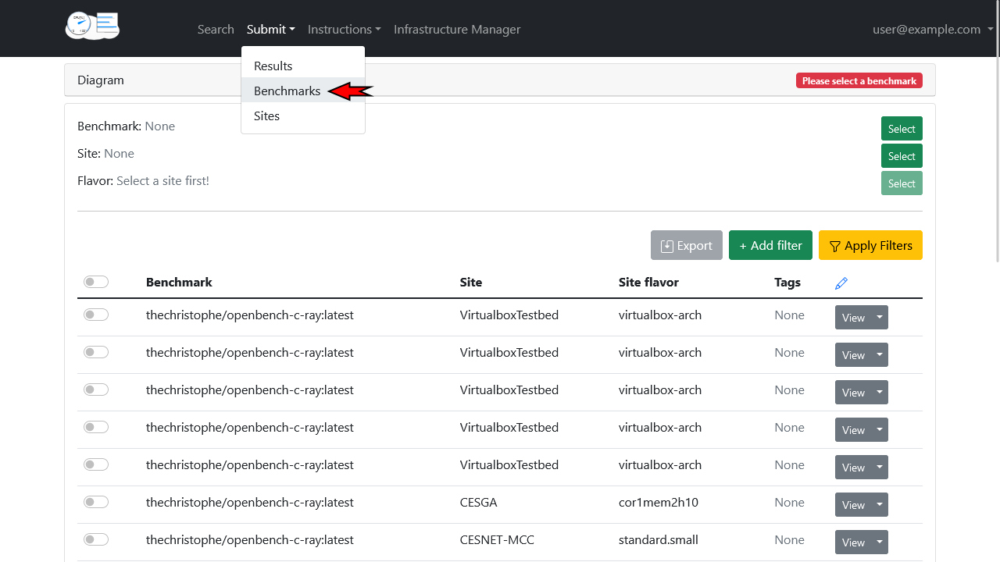
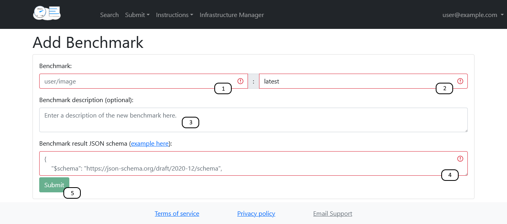

**********************
Adding a new benchmark
**********************

Requirements for benchmark
###########################
1. The Benchmark is publicly available from the `Docker Hub <https://hub.docker.com/>`__
2. It produces a `JSON <https://en.wikipedia.org/wiki/JSON>`__ output file
3. (optional but recommended) `JSON schema <https://json-schema.org/>`__ for the output file is available

Adding a benchmark via the website
###################################

To submit a new benchmark, first navigate to the Benchmark Submission Page:

On the benchmark submission page:

1. Enter the docker image name of your benchmark (for example: thechristophe/openbench-c-ray)
2. Enter the tag of your docker image you used
3. (optional) Add a description of your benchmark for other users.
4. Add the JSON schema the results of this benchmark must conform to
5. Submit your result

Uploading a benchmark using the API
################################

For a detailed example on how to use the API to submit a benchmark, please have a look at the `Jupyter notebook <https://github.com/EOSC-synergy/eosc-perf/blob/master/service_backend/docs/source/features/benchmarks.ipynb>`__.
