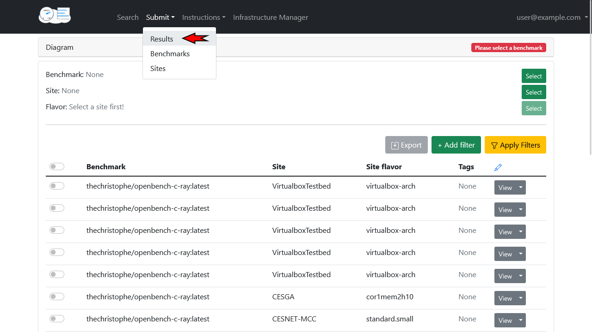
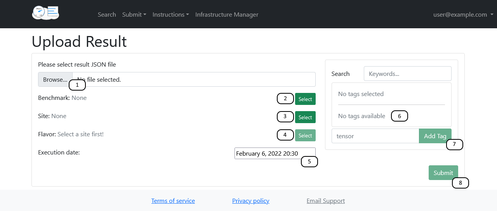
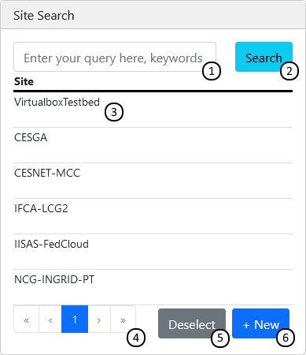

*******************
Adding a new result
*******************

Requirements for results
########################
1. You are able to authenticate via EGI Check-In
2. Results are in the JSON format
3. Results belong to one of the already registered benchmarks (if not, please, see :doc:`Adding a new benchmark <add_a_benchmark>`)
4. The Site, Flavor, and time for the benchmark run is known.

Uploading a result via the website
##################################

To submit a new result, first navigate to the Result Submission page using the navigation bar:

On the result submission page:

1. Select the JSON containing the benchmark result data
2. Select the benchmark that was used to obtain this data
3. Select the site on which your virtual machine was hosted
4. Select the type of virtual machine you deployed
5. Select the date and time on which you ran the benchmark
6. (optional) Select any filtering tags
7. (optional) Add tags if none match your needs
8. Submit your result

1. Search through names and descriptions using keywords, separated by spaces
2. Re-run search
3. Select entry
4. Navigate between pages
5. Deselect / select nothing
6. Submit a new entry

Uploading a result via the API
##############################

For a detailed example on how to use the API to submit a result, please have a look at the `Jupyter notebook <https://github.com/EOSC-synergy/eosc-perf/blob/master/service_backend/docs/source/features/results.ipynb>`__.
