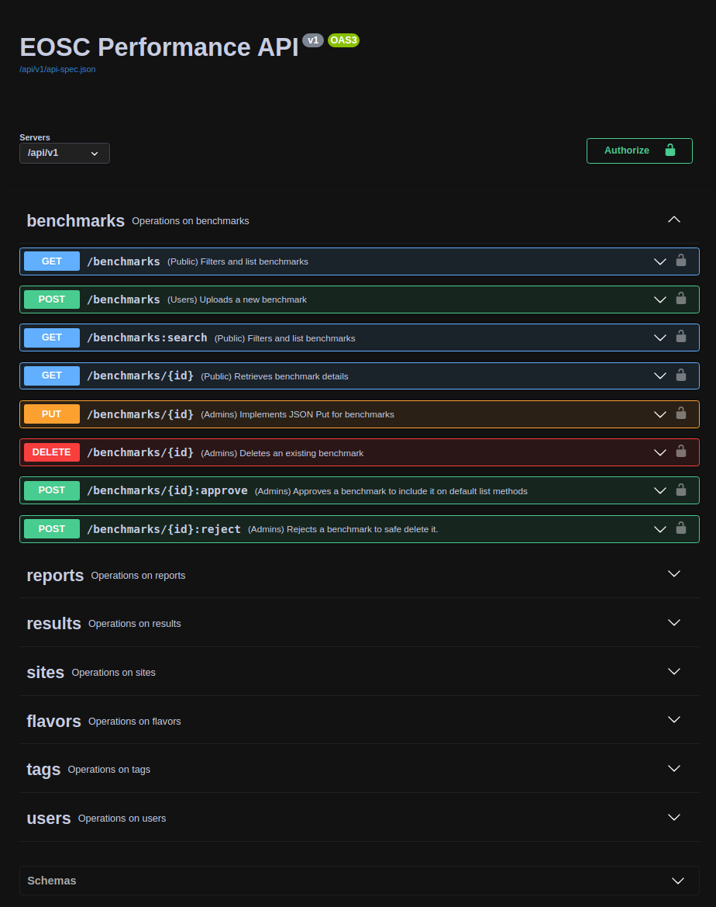

**********************
How to use the API
**********************

The EOSC Performance API uses REST. JSON is returned by all API responses
including errors and HTTP response status codes are to designate success
and failure.

All resources are documented following the OpenAPI Version 3 specification. 
Find the last version under `performance.services.fedcloud.eu/api/v1/api-spec.json`_
and access the API endpoint at `performance.services.fedcloud.eu/api/v1`_.

.. _performance.services.fedcloud.eu/api/v1/api-spec.json: https://performance.services.fedcloud.eu/api/v1/api-spec.json
.. _performance.services.fedcloud.eu/api/v1: https://performance.services.fedcloud.eu/api/v1

Authentication and authorization
################################

Requests to the EOSC Performance public API are for public and private
information. Endpoints availability is marked with with tags on the method
description:

 - **Public**: Does not require authentication
 - **Users**: Requires registration and authentication.
 - **Admins**: Requires authentication and administration authorization. 

Token
==================
The **Authorization** HTTPS header should be specified using the format
``Authorization: Bearer <your-access-token>`` to authenticate as a user
and have the same permissions as the user itself. You can obtain the access
token using `oidc-agent`_.

.. _oidc-agent: https://indigo-dc.gitbook.io/oidc-agent

Registration
==================
The usage of POST methods are restricted to authenticated and registered
users. Registration in the service means the user accepts the
`terms of service`_ exposed at EOSC Performance. You can accept those
terms via GUI or by using the POST method ``users:register`` as an
authenticated user using an access token.

.. _terms of service: https://performance.services.fedcloud.eu/terms-of-service

.. code-block:: bash 

    $ curl -X 'POST' \
        'https://perf.test.fedcloud.eu/api/v1/users:register' \ 
        -H 'Authorization: Bearer <your-access-token>'

The registration request does not require additional data as body.

Requests
################################

The API endpoint can only be accessed by **https**, all the **http** attempts
would receive ``301 Moved Permanently``. A graphical Swagger web interface
is available at the root endpoint to provide user friendly documentation,
interface and examples.

Examples
==================
Anonymous request example using bash:

.. code-block:: bash 

    $ curl -X 'GET' \
        'https://performance.services.fedcloud.eu/api/v1/benchmarks'

Authenticated request example using bash:

.. code-block:: bash 

    $ curl -X 'POST' \
        'https://performance.services.fedcloud.eu/api/v1/users:register' \
        -H 'Authorization: Bearer <your-access-token>'

