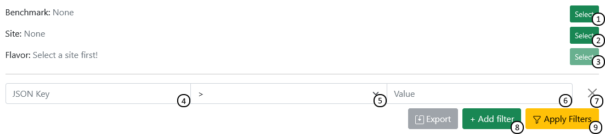
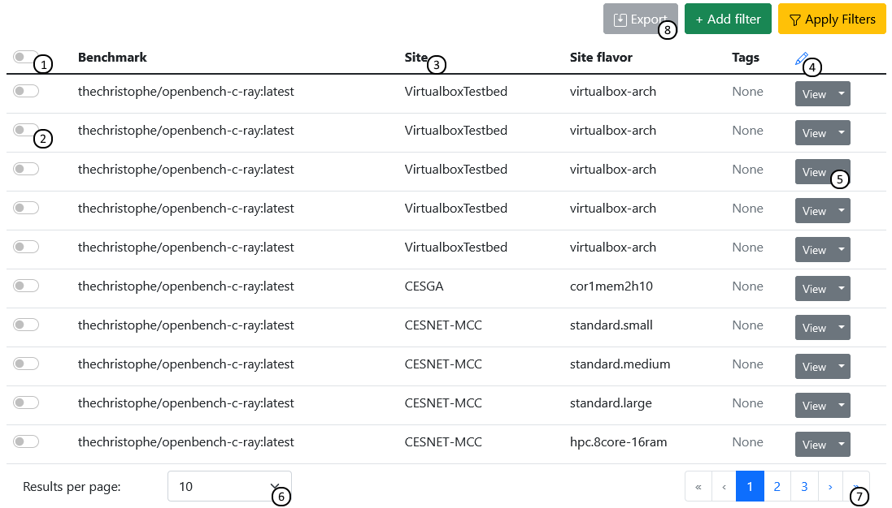
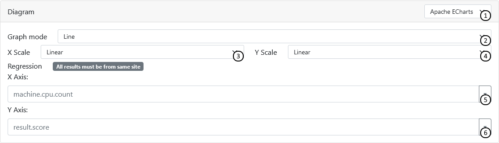

****************************************
Searching through results on the website
****************************************

When you first load the website, you will be redirected to the `result search page <https://performance.services.fedcloud.eu/search/results>`__.
By default, it will display up the 20 most recently uploaded results.
Not every data is useful to everyone, so the user is provided with some tools to filter out irrelevant data.

Filtering
#########

The application offers filtering the results by various criteria, including the benchmark that was ran [1], the site it was ran on [2], and the configuration of virtual machine (‘flavor’) that was used [3].
Additionally, users may filter by any amount of data points, specifically specific fields from the results’ JSON data. Users may refer [4]  to a field in the json structure by chaining together the names of the keys with periods, and compare it against given values [6].
For example, ::

    { “machine”: { “cpu”: { “core_count”: 4 } } }

would be referred to as ‘machine.cpu.core_count’.

Detail
******

1. Select benchmark to filter by
2. Select site to filter by
3. If a site is selected, select a filter to filter by

JSON Filter:

4. Specify JSON-key to filter by (structed as path.to.value)
5. Set comparison mode
6. Specify value you want to compare against
7. Remove filter

8. Add a new filter
9. Update search results using given filtering options

Compare in table
################

Results matching the search criteria are displayed in a table. This table can be used to interact with specific results (selecting [2], viewing or reporting[5]), and can also be configured to display columns containing specific data fields [4], using the json structure notation explained in the Search overview.

Detail
******

1. Select all results
2. Select one result
3. Click on a column to sort by it
4. Add or remove custom columns using json path syntax
5. View or report result
6. Configure the number of results to display
7. Navigate between pages of results
8. Export selected results' columns as a .csv file

Compare on the plot
###################

You may generate a plot using the values you have selected. The range of features may vary by which diagram engine you have selected, but the most common one, Apache ECharts, allows you to select one JSON value for each axis and configuring the plot scaling. The diagram will then display all selected results as a 2D graph.

Detail
******

1. Select diagram engine of your choice
2. Select diagram type
3. Choose between linear and logarithmic scaling for the X axis
4. Choose between linear and logarithmic scaling for the Y axis
5. Enter json key of source data to display on X axis
6. Enter json key of source data to display on Y axis
