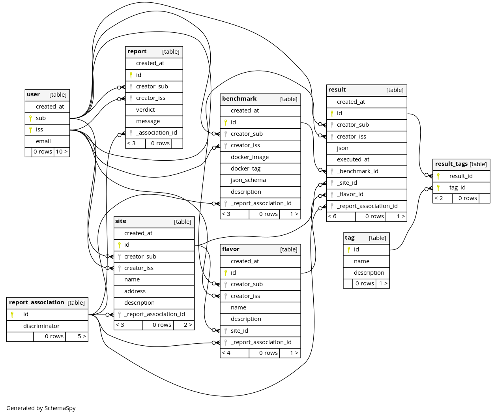
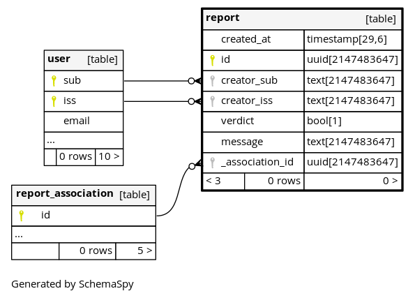

Models package
======================

.. automodule:: backend.models

The following diagram represents a relationships between the SQL models. 

Note the classes representing the models might contain additional 
properties. For example association_proxies or column_properties which
are simple mirroring or calculations between self and relationships
properties. 

The following chapters represent the expected usable models and their
main accessible properties. Some tables such as results_tags or 
report_association are built-in tables automatically generated by the
corresponding mixin (i.e. report.HasReports)

Benchmark model
-----------------

.. image:: ../../schemaspy/diagrams/tables/benchmark.1degree.png

.. autoclass:: backend.models.Benchmark
   :members:
   :member-order: bysource
   :undoc-members:
   :show-inheritance:

Flavor model
-----------------

.. image:: ../../schemaspy/diagrams/tables/flavor.1degree.png

.. autoclass:: backend.models.Flavor
   :members:
   :member-order: bysource
   :undoc-members:
   :show-inheritance:

Report model
-----------------

.. autoclass:: backend.models.Report
   :members:
   :member-order: bysource
   :undoc-members:
   :show-inheritance:

Result model
-----------------

.. image:: ../../schemaspy/diagrams/tables/result.1degree.png

.. autoclass:: backend.models.Result
   :members:
   :member-order: bysource
   :undoc-members:
   :show-inheritance:

Site model
-----------------

.. image:: ../../schemaspy/diagrams/tables/site.1degree.png

.. autoclass:: backend.models.Site
   :members:
   :member-order: bysource
   :undoc-members:
   :show-inheritance:

Tag model
-----------------

.. image:: ../../schemaspy/diagrams/tables/tag.1degree.png

.. autoclass:: backend.models.Tag
   :members:
   :member-order: bysource
   :undoc-members:
   :show-inheritance:

User model
-----------------

.. image:: ../../schemaspy/diagrams/tables/user.1degree.png

.. autoclass:: backend.models.User
   :members:
   :member-order: bysource
   :undoc-members:
   :show-inheritance:
