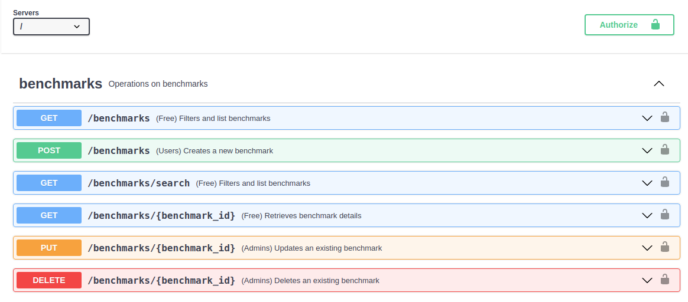

Introduction
###################
EOSC Performance aims to bring a platform where users can compare multiple
cloud providers to decide the best place and configuration to run their
applications.

In order to achieve such objective, EOSC Performance API provides the
backend with the logic to store and filter all the benchmark results provided
by the community.

OpenAPI specification
=========================
In order to improve usability, the API provides an **OpenAPI v3**
specification which can be accessed at the path ``/api-spec.json``.
Additionally the root path provides a Graphical User Interface (GUI) build
with `Swagger UI <swagger_ui_>`_ that users can use to test,
interface and learn about the multiple methods offered by this API.

More information about the OpenAPI community can be found at their home page
`openapis.org <openapi_home_>`_.

.. _swagger_ui: https://swagger.io/tools/swagger-ui/
.. _openapi_home: https://www.openapis.org/

Project source
===================
EOSC Performance is an open source project. You can review, fork the
code source, reproduce the application, open and review issues accessing
`our code repository <hosted_source_>`_. Any support and comments form the
community on how to improve our application and code quality are welcome.

.. _hosted_source: https://github.com/EOSC-synergy/eosc-perf

OIDC Tokens
=========================
Although most of the GET reports are open to any request from any user,
some are restricted to identified users and administrators. In order to
identify into the service, the technology used is **OpenID Connect**.

More information about OpenID Connect can be found at their home page
`openid.net <oidc_home_>`_.

In order to obtain an OIDC token you can use to identify yourself when
using the API, we recommend the tool `oidc-agent <oidc_agent_>`_. Once
configured, you can easily store your access token as environment
variable, for example:

.. code-block:: bash

    $ OIDC_TOKEN=oidc-token <your-account>

.. _oidc_home: https://openid.net/
.. _oidc_agent: https://github.com/indigo-dc/oidc-agent/

Registration process
=========================
Although most of the GET reports are open without registration required,
those users that want to provide benchmark results from their platforms
need to confirm that they have read and accepted our terms and conditions:

- `Privacy policy <privacy_policy_>`_

.. _privacy_policy: https://performance.services.fedcloud.eu/privacy_policy

Once the terms are understood and you decide to continue with the
registration process, you can register using the method ``POST /users/self``
with an OIDC token as authorization bearer. For example:

.. code-block:: bash

    $ curl -X 'POST' \
        'http://localhost:5000/users/self' \
        -H "accept: application/json" \
        -H "Authorization: Bearer $OIDC_TOKEN"

The response will return your stored information:

.. code-block:: bash

    $ curl -X 'POST' \
        'http://localhost:5000/users/self' \
        -H "accept: application/json" \
        -H "Authorization: Bearer $OIDC_TOKEN"

